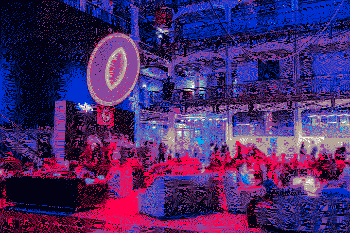
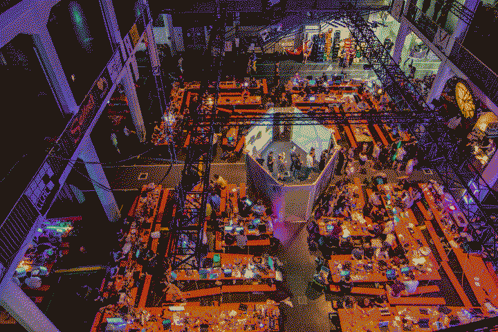

# GPN 19

My third GPN.

This time, I was there pretty much alone and thus getting a room with multiple people in the hotel like the last years wasn't an option, so I stayed in "Jugendherberge Karlsruhe". Turns out: it didn't really work. As already at the <a href="/events/2017/12-34c3/">34c3</a>, I came to the booked room and there were already people sleeing in all beds. Due to it being like four o'clock in the morning after the first day of the event, the reception wasn't open (yet) and I just went back to the venue and didn't sleep.

<a href="https://www.flickr.com/search/?text=%23GPN19">https://www.flickr.com/search/?text=%23GPN19</a>

</pre>

    </img>
    <a href="https://flic.kr/p/2g81iXE">https://flic.kr/p/2g81iXE</a>
    </img>
    <a href="https://flic.kr/p/2g88LWj">https://flic.kr/p/2g88LWj</a>

</pre>

