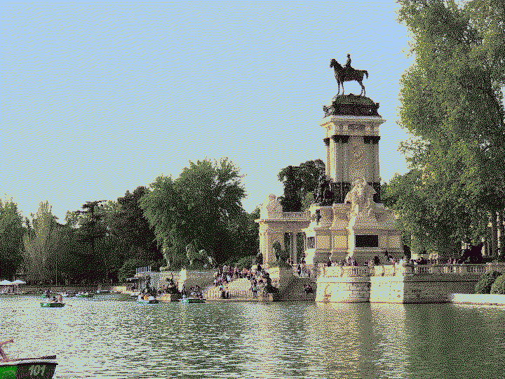

# BountyConEdu

<a href="https://about.facebook.com/meta/">Meta</a> (aka. facebook) hosted the first <a href="https://bountyconedu2022.splashthat.com">BountyConEdu</a> from 2022-04-29 to 2022-05-01 in <a href="https://en.wikipedia.org/wiki/Madrid">Madrid</a> at the <a href="https://www.marriott.com/en-us/hotels/madad-madrid-marriott-auditorium-hotel-and-conference-center/overview/">Marriot Auditorium</a>.

We took the opportunity as a team, applied and got accepted resulting in 9 people from our team alone visiting the event. In the end, there were quite a lot of people from germany attending, such as the FluxFingers team, Gehim, Chiliz as well as Lukas Gerlach who won the individual category.

Due to the us not meeting much in person, it was a great opportunity to meet and on to of that, socialize with people from other teams from all over Europe.  We visited Madrid together and had quite some fun.

On Friday, I talked quite a lot with some people from malta, greece, france and the UK.

On Saturday evening, we visited Madrid with people from Scotland, the UK, Hungary, Sweden, Sitzerland and Germany.

On Sunday evening, we visited Madrid again with a group consisting mostly of people from Germany, but with some Greek and a person from France.

</pre>

 </img> 

</pre>

