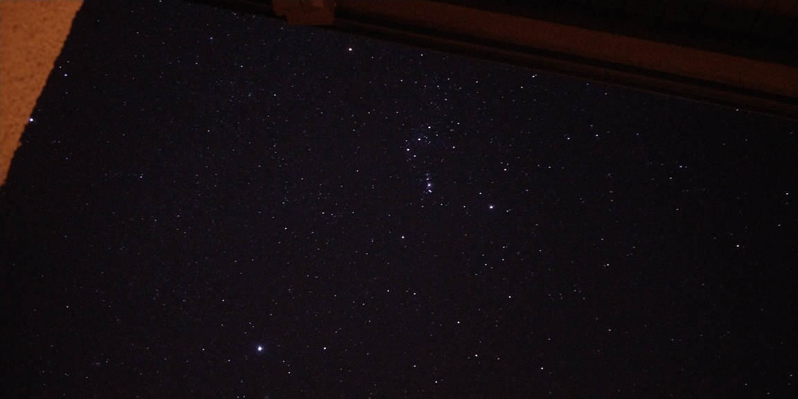
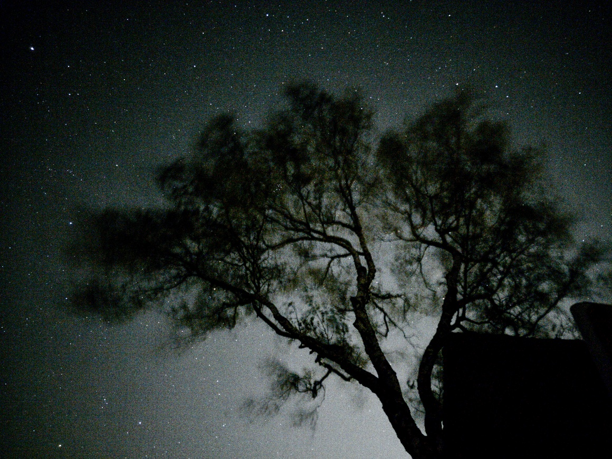
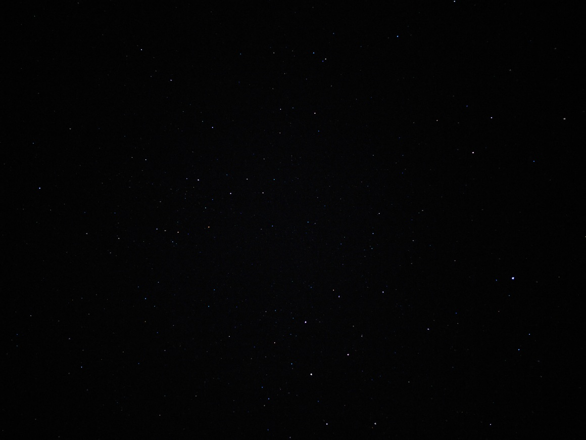

# Astrophotography

:::toc

## 2022-01-01 fiss ladis

During the <a href="/events/2022/01_ski_fiss_ladis/">2022-01-ski-fiss-ladis</a> trip, I took some pictures with my phone, as the conditions were optimal the first day:

<a href="./IMG_20220101_223758.jpg">full-res-image 2.6 MB)</a>

## 2020-10-20 düsseldorf angermund

The bright light in the background is the Düsseldorf airport. It is really annoying, as depending on how the clouds are, the complete sky is diffused at night making it impossible to view the stars. On this night, the conditions made it a nice backdrop.

<a href="./IMG_20201020_012707.jpg">full-res-image 9.2 MB)</a>

## 2020-07-23 düsseldorf angermund

This image has been edited (I played around with the saturation a bit, should explain the bright red/green/blue colors) (best viewed in the full-res variant):

<a href="./IMG_20200723_123728_edited.jpg">full-res-image 1.9 MB)</a>
