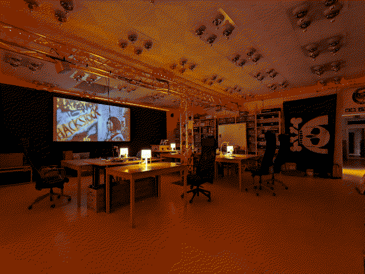
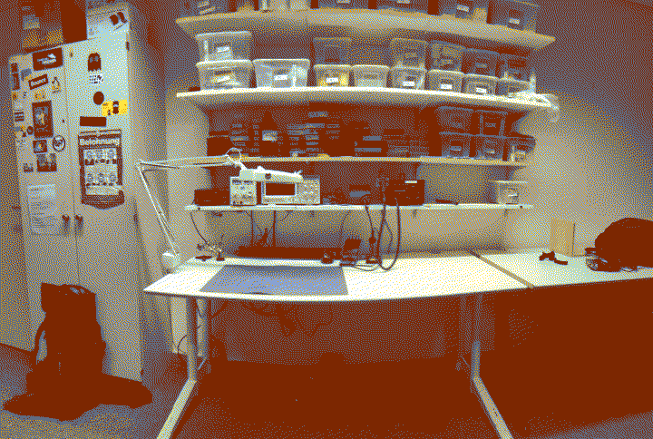

# chaosdorf

Hackspace in Düsseldorf.

Goals for 2022: increase the amount of security communication, meaning that there should be a lot more security talks, workshops, foos and other kinds of events.

</pre>

    </img>

    </img>

</pre>

