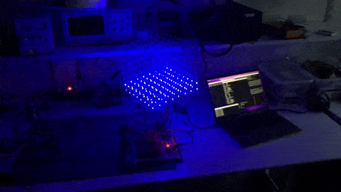

# led-cube

Started out with a 4x4x4 cube, then built this 8x8x8 cube which took ages, but just looks amazing (imho).

It is controlled by shift registers, so each "cycle" eight bytes are pushed into them and another byte is pushed into a shift register to determine which layers to illuminate. In the gif below, all eight shift registers are filled with 0x7f (0b11111111) and the layers are toggled making it bounce up and down)

I've also taught some interns how to build a 4x4x4 from scratch, although we doubled the distances between the LEDs, as it was their first time soldering. Turns out: that was a great project for teaching them everything from how to plan such a project, to creating some plans, executing it (soldering and putting together electronics) and in the end program it so make it do fun stuff (playing around with binary numbers).

</pre>

    </img>

</pre>

