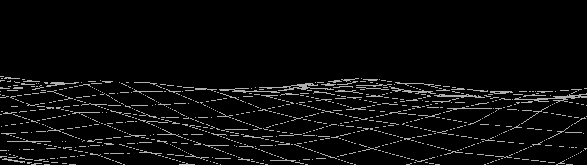
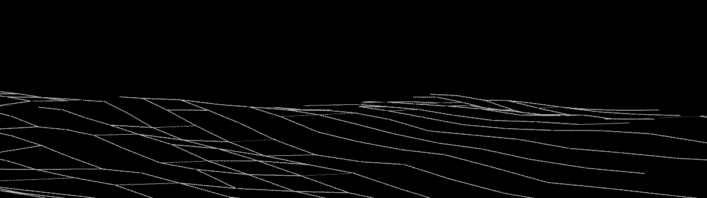
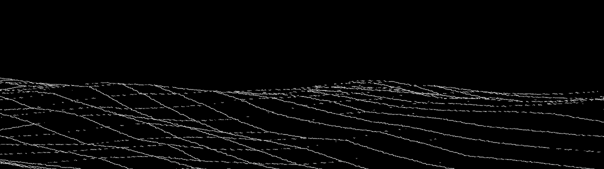
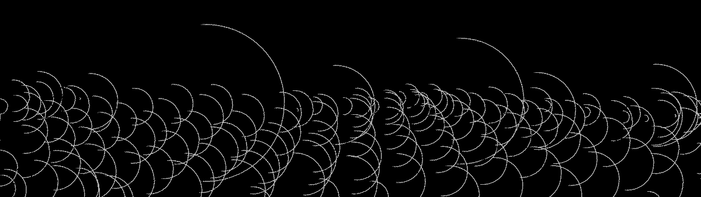
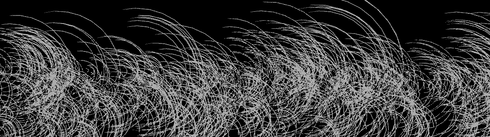
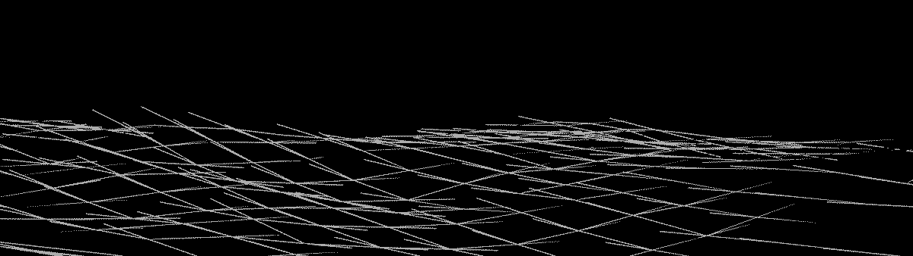
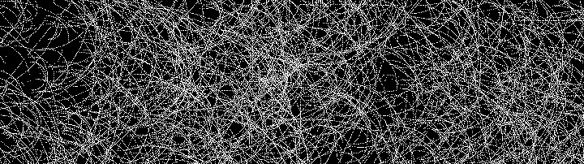

# lumipa

small art project consisting of freestyle blender waves

</img>
<a href="00.blend">00.blend</a> <a href="00_small.png">00_small.png (97KB)</a> <a href="00.png">00.png (2.2MB)</a>

</img>
<a href="01.blend">01.blend</a> <a href="01_small.png">01_small.png (83KB)</a> <a href="01.png">01.png (1.1MB)</a>

</img>
<a href="02.blend">02.blend</a> <a href="02_small.png">02_small.png (95KB)</a> <a href="02.png">02.png (2.2MB)</a>

</img>
<a href="03.blend">03.blend</a> <a href="03_small.png">03_small.png (123KB)</a> <a href="03.png">03.png (2.5MB)</a>

</img>
<a href="04.blend">04.blend</a> <a href="04_small.png">04_small.png (280KB)</a> <a href="04.png">04.png (3.8MB)</a>

</img>
<a href="05.blend">05.blend</a> <a href="05_small.png">05_small.png (104KB)</a> <a href="05.png">05.png (2.3MB)</a>

</img>
<a href="06.blend">06.blend</a> <a href="06_small.png">06_small.png (104KB)</a> <a href="06.png">06.png (2.3MB)</a>
