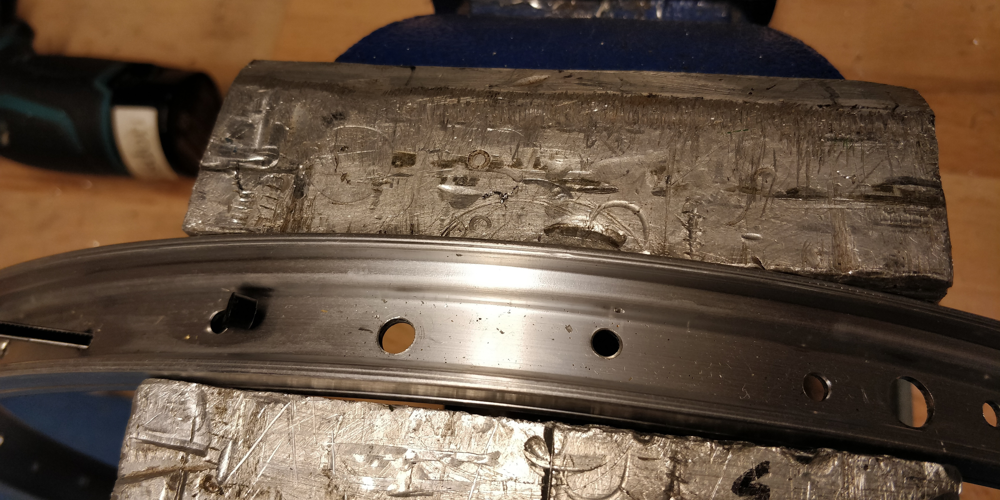

# trike

So, what's this "trike" thing? Well, it's a bike, but with three wheels. Now
there are two options doing this: two wheels in the front and one in the back
or one in the front and two in the back.

I'm going the "two in the front" way.

:::toc

## setup

>            ----------
>                 |
>                  \                          +---------
>                   \                         |
>  ----------+---------------+----------------|  -------------
>   "boom"          /          backrest       |  back wheel
>                  /                          +---------
>                 |      
>            ----------
>            front wheel
>   

## wheels

So the front wheels have some conditions that have to be met:

- 20"
- single sided axle
- disk brakeable

### the original wheels

</img>

One of the wheels taken apart

</img>

So the components of a wheel are actually quite simple. you've got:

- the rim (the big round thing encircling all the other parts)
- the hub (left)
- the spokes (middle)
- nipples (right)

### new hubs

Now the old hubs had a few issues:

- not single sided
- not disk brakeable

So I exchanged the hubs for ones that could be mounted from one side. The
problem: due to the new hubs being bigger, the spokes were to long resulting in
utter chaos. So I went and bought new spokes (shorter ones). The problem with
these: they are a lot thicker and didn't fit through the holes in the hub, so I
went and enlarged the 72 holes in both hubs by just drilling through them with
a slightly larger drill bit.

</img>
</img>

Same for the front rims:

</img>

In the end, it all fit quite well (although it took quite some time to get the
spokes all into the rim holes, as they would not bend at all).

</img>

Front wheels done:

</img>

## frame

The idea for the frame is to build it up kind of like this (you should get the
idea):

</img>

Now the frame won't lie on the floor as in the image above, but will be
connected and form a 3D mesh. For this to work, there are a few cuts that have
to be made:

</img>
</img>

## headset

The "headset" is the part which normally combines the fork and the frame. As I
don't have a fork, but more of an axle, I have to think of something else.

I've bought a whole old broken bike on ebay-kleinanzeigen and an old individual
fork which I'll use for this.

</img>
</img>
</img>
</img>
</img>

## seat

## drive train
