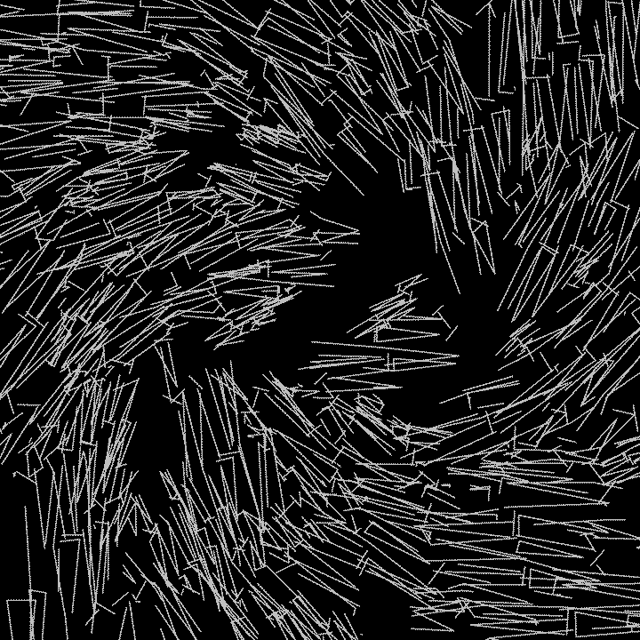
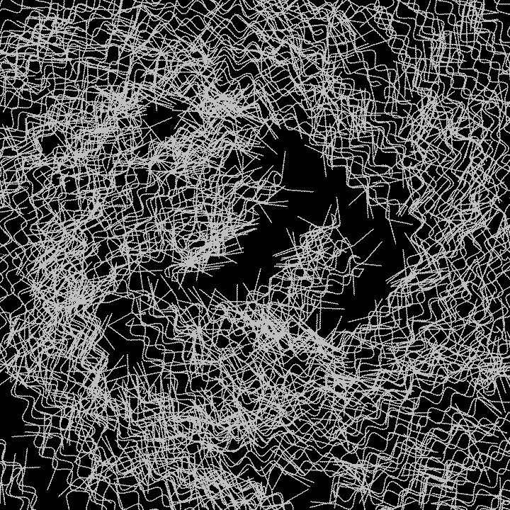

# xika

</pre>

    

        </img>
        <a href="00.blend">00.blend</a>
        <a href="00_large.png">00_large.png (2.9MB)</a>
    

    

        </img>
        <a href="01.blend">01.blend</a>
        <a href="01_large.png">01_large.png (2.8MB)</a>
    

    

        </img>
        <a href="02.blend">02.blend</a>
        <a href="02_large.png">02_large.png (2.6MB)</a>
    

    

        </img>
        <a href="03.blend">03.blend</a>
        <a href="03_large.png">03_large.png (3.4MB)</a>
    

    

        </img>
        <a href="04.blend">04.blend</a>
        <a href="04_large.png">04_large.png (3.3MB)</a>
    

    

        </img>
        <a href="05.blend">05.blend</a>
        <a href="05_large.png">05_large.png (2.9MB)</a>
    

    

        </img>
        <a href="06.blend">06.blend</a>
        <a href="06_large.png">06_large.png (3.5MB)</a>
    

    

        </img>
        <a href="07.blend">07.blend</a>
        <a href="07_large.png">07_large.png (3.9MB)</a>
    

    

        </img>
        <a href="08.blend">08.blend</a>
        <a href="08_large.png">08_large.png (3.0MB)</a>
    

</pre>

