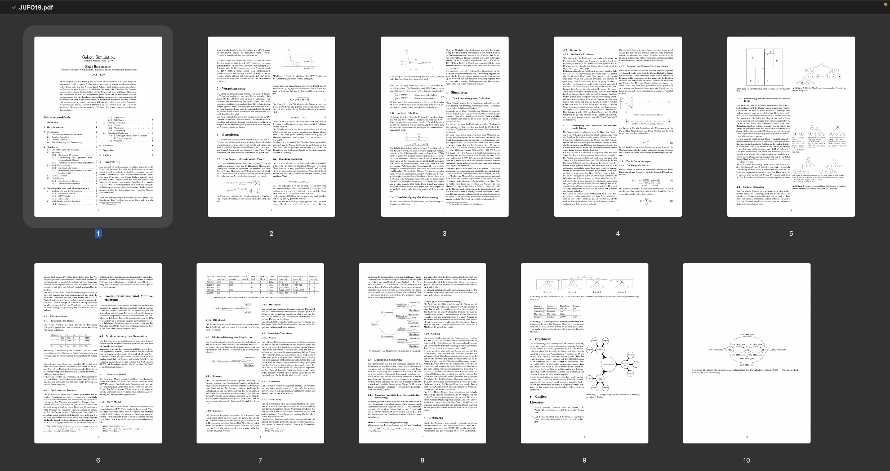

# Galaxy Simulation

During my internship in Heidelberg (Summer 2017), I started looking into how to simulate galaxies. For simulating galaxies, I had to find out how to first generate them. After doing so and having generated a lot of stars, I started building software to simulate the galaxies.

The whole project was then submitted to the Jugend-Forscht competition which requires a writeup of a few pages. You can read the writeup <a href="./JUFO19.pdf">here</a> and view the project source in the <a href="https://github.com/galaxy-simulator">git orga</a>

</img>
