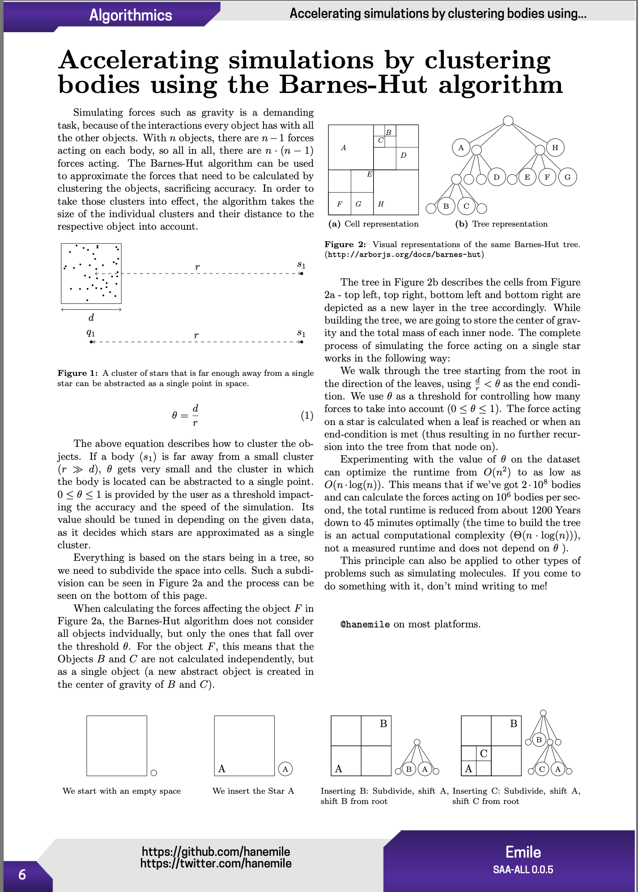

# Accelerating simulations by clustering bodies using the Barnes-Hut algorithm

A one page writeup of my Jugend-Forscht project from the beginning of 2019.

Read the page <a href="./barnes_hut.pdf">here</a> or the whole <a href="https://pagedout.institute/download/PagedOut_001_beta1.pdf">Paged Out! Issue 1</a>.

<a href="./barnes_hut.pdf"></img></a>
