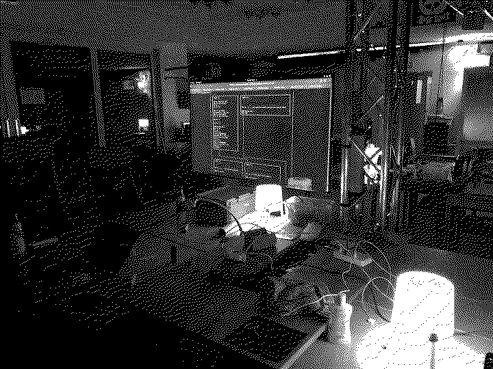

# workshop

:::toc

workshops are kind of like talks, with the little but fundamental difference, that there is some kind of interaction between the speaker and the audience. This allowes the "audience" which are mostly called participants to actually try stuff hands on.

I kind of like workshops, as just watching a talk can be rather boring, but a workshop can also become quite weird if there isn't any real plan.

One thing that set's workshops apart from talks is the size: talks can be done at an arbitrary scale, while workshops are limited in the amount of participants: to many and the interaction between the speaker and the participants and between the participants themselves isn't ideal.

I'd say workshops can be done to a scale of about 10 people, but this varies a lot depending of the size, the knowledge the participants already have, the kind of workshop and other factors.

</pre>

    </img>

</pre>

## series

Here some descriptions for the individual series until I find the time to write
stuff for the individual events:

### ctf-foo

After hosting multiple ctf workshops teaching people the basics, the people kept coming, so I just starting doing it on a regular basis.

### heap-foo

Heap exploitation is one of the topic you can spend an ethernity on, so we're starting slowly with a series of 15-20 workshops going from the very basics to diving deep into the depts of varios heap related topics.

### web-foo

Web application security is a wide field with interesting topics. Let's go through them so everyone can have a change at understanding the issues and how to fix them.

### crypto-foo

Cryptography can be fun, if you understand it. In this series of workshops, we'll teach the basics of the thing's that might be of interest in cryptography and break some stuff on the way.

## tree
 
:::tree

## cal

### 2022

             January               |              February      
 Su   Mo   Tu   We   Th   Fr   Sa  |  Su   Mo   Tu   We   Th   Fr   Sa
                                1  |             1    2    3    4    5
  2    3    4    5    6    7    8  |   6    7    8    9   10   11   12
  9   10   11   12   13  <a href="">14</a> <a href="/2022/ctf-foo/01-15">15</a> |  13   14   15   16   17   18   19
 16   17   18   19   20   21   22  |  20   21   22   23   24   25   26
 23   24   25   26   27   28   29  |  27   28                         
 30   31                           |
   
             March                 |              April              
 Su   Mo   Tu   We   Th   Fr   Sa  |  Su   Mo   Tu   We   Th   Fr   Sa
            1    2    3    4    5  |                            1    2
  6    7    8    9   10   11   12  |   3    4    5    6    7    8    9
 13   14   15   16   17   18   19  |  10   11   12   13   14   15   16
 20   21   22   23   24   25   26  |  17   18   19   20   21   22   23
 27   28   29   30   31            |  24   25   26   27   28   29   30
 
             May                   |              June              
 Su   Mo   Tu   We   Th   Fr   Sa  |  Su   Mo   Tu   We   Th   Fr   Sa
  1    2    3    4    5    6    7  |                  1    2    3    4
  8    9   10   11   12   13   14  |   5    6    7    8    9   10   11
 15   16   17   18   19   20   21  |  12   13   14   15   16   17   18
 22   23   24   25   26   27   28  |  19   20   21   22   23   24   25
 29   30   31                      |  26   27   28   29   30          
 
             July                  |              August           
 Su   Mo   Tu   We   Th   Fr   Sa  |  Su   Mo   Tu   We   Th   Fr   Sa
                           1    2  |        1    2    3    4    5    6
  3    4    5    6    7    8    9  |   7    8    9   10   11   12   13
 10   11   12   13   14   15   16  |  14   15   16   17   18   19   20
 17   18   19   20   21   22   23  |  21   22   23   24   25   26   27
 24   25   26   27   28   29   30  |  28   29   30   31               
 31                                |   
 
             September             |              October           
 Su   Mo   Tu   We   Th   Fr   Sa  |  Su   Mo   Tu   We   Th   Fr   Sa
                      1    2    3  |                                 1
  4    5    6    7    8    9   10  |   2    3    4    5    6    7    8
 11   12   13   14   15   16   17  |   9   10   11   12   13   14   15
 18   19   20   21   22   23   24  |  16   17   18   19   20   21   22
 25   26   27   28   29   30       |  23   24   25   26   27   28   29
                                   |  30   31                         
       
             November              |              December         
 Su   Mo   Tu   We   Th   Fr   Sa  |  Su   Mo   Tu   We   Th   Fr   Sa
            1    2    3    4    5  |                       1    2    3
  6    7    8    9   10   11   12  |   4    5    6    7    8    9   10
 13   14   15   16   17   18   19  |  11   12   13   14   15   16   17
 20   21   22   23   24   25   26  |  18   19   20   21   22   23   24
 27   28   29   30                 |  25   26   27   28   29   30   31

